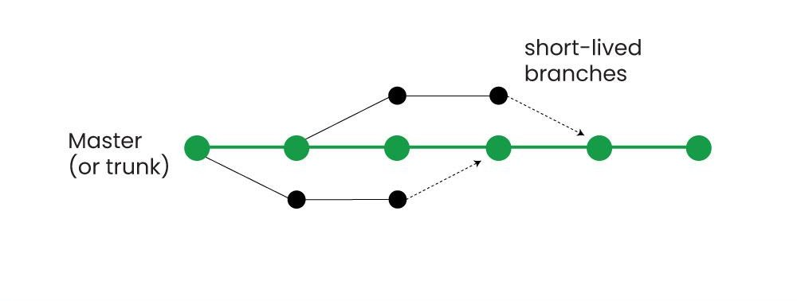

# Software Quality Handbook

## Overview

This project is a collaborative Software Quality Handbook developed as part of a group assignment for the Software Quality Assurance module (Lecturer: Neil O’Connor). It focuses on key practices used in modern software development to improve code quality, team collaboration, and project reliability.

The handbook covers three core topics:

- Code Reviews
- Task Estimation
- Defect Management

The project was developed using a GitHub-based workflow, where team members worked on feature branches, submitted pull requests, and reviewed each other’s work. This reflects real-world development practices and supports continuous improvement.

Each topic section covers best practices, bad practices to avoid, common challenges, a real world example, and links to further reading.

---

## Table of Contents

1. [Code Reviews](topics/code-reviews.md)
2. [Task Estimation](topics/task-estimation.md)
3. [Defect Management](topics/defect-management.md)
4. [Project Plan](project-plan.md)
5. [Team Contributions](team-contributions.md)
6. [Retrospective](retrospective.md)

---

## How to Use

You can browse the handbook directly on GitHub using the links above, or clone the repository and open the markdown files locally in a code editor such as VS Code.

---

## Team Contributions

| Member | Primary Responsibility | Contributions                                                                                   |
| ------ | ---------------------- | ----------------------------------------------------------------------------------------------- |
| Jack   | Task Estimation        | Wrote and refined task estimation section, added research, examples, and iterative improvements |
| Dylan  | Code Reviews           | Developed code reviews section, structured content, added sources and workflow explanation      |
| Shane  | Defect Management      | Created defect management section, added practices, challenges, and improvements                |

All team members:

- Reviewed each other’s work
- Provided feedback through pull requests
- Approved and merged contributions collaboratively

---

## Workflow

The project followed a structured GitHub workflow:

1. Create a feature branch
2. Make changes incrementally
3. Commit updates with clear messages
4. Push branch to GitHub
5. Open a pull request
6. Get feedback from teammates
7. Approve and merge into main

This approach ensured:

- consistent collaboration
- clear development history
- continuous improvement

---

This approach also reflects trunk-based development, where small, frequent changes are integrated into the main branch through short-lived feature branches and continuous feedback.

### Trunk-Based Development

_Figure: Short-lived branches merging into the main trunk in trunk-based development._

## Key Learnings

- Collaboration improves quality through shared feedback
- Breaking work into smaller commits makes tracking easier
- Estimation and defect management involve real-world uncertainty
- Code reviews are essential for maintaining code quality

---

## Repository Structure

The project is organised into separate topic files for clarity and ease of navigation:
