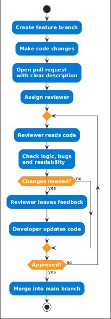

# Code Reviews

## Overview

Code reviews are when developers check each other’s code before it gets added to the main branch. It’s basically a way of making sure the code is correct and follows the same standards across the team.

## Why It Matters

Code reviews are important because they help catch bugs early before the code goes live. They also improve the overall quality of the code and make it easier to understand. Another benefit is that team members can learn from each other by seeing different ways of solving problems.

They also act as an important quality control step before code is merged, helping reduce defects reaching production.

This also supports long-term maintainability of the codebase.

## Best Practices

- Keep pull requests small so they are easier to review
- Review code within a reasonable time
- Focus on logic, bugs and readability
- Clearly explain what the changes are doing
- Give feedback in a respectful and helpful way
- Ensure pull requests include enough context for reviewers
- Perform code reviews early and consistently as part of the workflow to catch defects before they reach later stages

## Bad Practices to Avoid

- Creating very large pull requests that are hard to review
- Ignoring feedback from other developers
- Merging code without it being properly reviewed
- Only focusing on small things like formatting
- Leaving reviews too late
- Treating code reviews as optional or leaving them until the end of development

## Pull Request Workflow

In this team, code reviews will be done using pull requests. A developer creates a branch, makes their changes, and then opens a pull request. Another team member reviews the code and either suggests changes or approves it. Once approved, the code is merged into the main branch.

Pull requests should include a clear description of changes so reviewers can understand the context quickly.

### Pull Request Review Diagram

_Figure: Example pull request workflow showing review, feedback, approval, and merge steps._

## Common Challenges

- Large pull requests overwhelm reviewers. When a developer submits hundreds of lines of changes across multiple files with no clear summary, reviewers struggle to follow the logic and are more likely to miss bugs.

- Delayed reviews slow down the whole team. When a pull request sits waiting for several days, the author loses context and feedback becomes harder to act on. Reviews should happen promptly to keep momentum going.

- Focusing too much on style over substance wastes time. Reviewers can fall into the habit of commenting on formatting and spacing while missing more serious issues like security vulnerabilities or performance problems in the logic.

- Unconstructive feedback makes the process less effective. Comments that point out problems without explaining why or suggesting improvements put developers on the defensive rather than encouraging collaboration.

- When only senior team members review code, it creates knowledge silos. Less experienced developers miss the opportunity to learn patterns and the team becomes dependent on a small number of people to catch problems.

- Pull requests with no context force reviewers to guess. Without a clear description explaining what changed and why, reviewers have to hunt through tickets or make assumptions, which slows down the review and increases the chance of something being missed.

## Example

A developer works on a new feature for several days and opens a large pull request with over 400 lines of changes. The reviewer is unfamiliar with parts of the codebase and the pull request has no description explaining what was changed or why. The reviewer approves it quickly to avoid holding things up. A bug in the logic makes it to production and takes a full day to track down and fix.

 

The developer should have broken the work into smaller pull requests and included a clear description of the changes. The reviewer should not have rushed the approval. A quicker review turnaround on smaller, well described pull requests would have made it easier to catch the issue before it reached production.

## Further Reading

- Google Engineering Practices: Code Review — https://google.github.io/eng-practices/review/

- Atlassian: Code Reviews — https://www.atlassian.com/agile/software-development/code-reviews

- Martin Fowler: Code Review — https://martinfowler.com/articles/codeReview.html

- Abseil Software Engineering Book (Code Review) — https://abseil.io/resources/swe-book/html/ch09.html

- Google Engineering Practices (Summary) — https://solmaz.io/google-eng-practices-github

- Code Reviews: Just Do It — https://blog.codinghorror.com/code-reviews-just-do-it/

## Notes from Reading Sources

**Atlassian: Code Reviews:**

- Code reviews help catch bugs early before code reaches production
- Smaller pull requests are easier to review properly than large ones
- Reviews are more useful when they focus on correctness, logic, and readability
- Clear pull request descriptions help reviewers understand the changes faster

**Google Engineering Practices: Code Review:**

- Code reviews improve code quality and help keep standards consistent across the team
- Reviews work best when they are done early and regularly, not left until the end
- The goal is to improve the code, not just approve it quickly

**Martin Fowler: Code Review:**

- Code reviews help teams share knowledge and reduce dependence on one person
- They are useful for long-term maintainability, not just finding bugs
- Constructive feedback makes the review process more effective