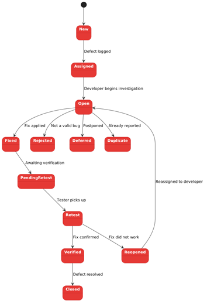

# Defect Management

## Overview

Defect management is the process of identifying, tracking, prioritising and resolving defects in a software project.
A structured defect management process ensures that issues are handled consistently and efficiently. Without this, defects can be missed or resolved in the wrong order.

<<<<<<< HEAD
=======
### Defect Lifecycle Diagram

_Figure: Example defect lifecycle showing how issues move from reporting to closure._

>>>>>>> a14a9f8 (enhanced defect management section with improved example and additional notes from sources)
## Why It Matters

- Helps teams respond to bugs in a more organised way
- Reduces confusion around priority and severity
- Improves visibility of defects across the project
- Supports better decision-making about what should be fixed first

## Best Practices

- Record defects clearly
- Include steps to reproduce the issue
- Agree on severity and priority levels
- Track defects through a defined lifecycle
- Fix high-priority issues first
- Use a tracking tool to manage and monitor defects

## Example

A tester logs a defect with the description "button not working" and no steps to reproduce. The developer cannot replicate the issue and marks it as closed. The same bug is reported again two weeks later by a different tester. This time it is investigated properly and turns out the button fails only when a user has a specific account type. By this point the feature has already been released to some users.

The original report should have included clear steps to reproduce the issue, the conditions it occurs under, and the expected versus actual behaviour. A structured defect process with proper lifecycle tracking would have prevented the issue from being closed prematurely and caught it before release.

## Common Challenges

- Confusion between severity and priority
- Incomplete or unclear bug reports
- Poor communication between team members
- Delays in triage or updating defect status

## Bad Practices to Avoid

- Reporting defects with little or no detail
- Confusing severity with priority
- Ignoring or delaying defect updates
- Fixing issues without properly tracking them
- Poor communication between team members

## Further Reading

- https://www.testrail.com/blog/defect-management/
- https://testsigma.com/blog/defects-in-software-testing/
- https://testrigor.com/blog/defect-based-testing/
- https://www.browserstack.com/guide/defect-management-in-software-testing
- https://katalon.com/resources-center/blog/defect-management-in-software-testing
- https://testomat.io/blog/bug-life-cycle-in-software-testing/
- https://www.alooba.com/skills/concepts/defect-management-423/defect-prioritization/
- https://www.caktusgroup.com/blog/2018/04/30/prioritizing-defects/

## Notes

<<<<<<< HEAD
- Defects should be clearly described with steps to reproduce
- Severity and priority are different concepts
- Defects go through a lifecycle such as open, in progress, resolved and closed
- Issue tracking tools help teams manage defects properly
=======
- TestRigor: Defect-Based Testing — https://testrigor.com/blog/defect-based-testing/

- BrowserStack: Defect Management in Software Testing — https://www.browserstack.com/guide/defect-management-in-software-testing

- Katalon: Defect Management in Software Testing — https://katalon.com/resources-center/blog/defect-management-in-software-testing

- Testomat: Bug Life Cycle in Software Testing — https://testomat.io/blog/bug-life-cycle-in-software-testing/

- Alooba: Defect Prioritization — https://www.alooba.com/skills/concepts/defect-management-423/defect-prioritization/

- Caktus Group: Prioritizing Defects — https://www.caktusgroup.com/blog/2018/04/30/prioritizing-defects/

## Notes from Reading Sources

**TestRail: Defect Management:**

- Defect management is a structured process for identifying, tracking, prioritising, and resolving defects
- Clear defect reports should include steps to reproduce the issue and enough detail for the developer to understand the problem
- Defects should move through a proper lifecycle so nothing gets lost or forgotten
- Prioritising based on business impact helps teams focus on the most important issues first

**TestSigma: Defects in Software Testing:**

- A defect is not always the same as a failure, so teams need to be clear about what kind of issue they are dealing with
- Severity and priority are different, and mixing them up can lead to poor decisions
- Good defect tracking improves communication between testers and developers

**BrowserStack: Defect Management in Software Testing:**

- A good defect process helps teams avoid missed bugs and keeps the workflow organised
- Defects should be logged consistently so the team can monitor status and progress
- Tracking tools make it easier to manage and update defects properly

**Testomat: Bug Life Cycle in Software Testing:**

- Defects usually follow a lifecycle such as new, assigned, fixed, retested, and closed
- A clear lifecycle makes it easier for the team to know where each bug stands
- Without updates, defects can be delayed or forgotten

**Katalon: Defect Management in Software Testing:**

- Defect management prevents bugs from slipping into production by catching them early
- Teams should use consistent severity/priority matrices to avoid confusion about fix order
- Automated tools help track defects through their full lifecycle from logging to verification

**TestRigor: Defect-Based Testing:**

- Focus testing on likely defect areas rather than rigid test case coverage
- Good reports need environment details such as browser, OS, and version since bugs often appear in specific setups
- Retesting fixed defects is critical — fixed does not mean verified working

**Alooba: Defect Prioritization:**

- Prioritization balances business risk, frequency of occurrence, and fix cost
- High severity/low priority bugs such as rare crashes can wait if they do not affect many users
- Regular triage meetings keep the defect backlog manageable

**Caktus Group: Prioritizing Defects:**

- Severity describes how bad the bug is technically, while priority shows business urgency
- Use a matrix combining impact and likelihood to decide fix order, not just gut feel
- Fix critical path blockers first, even if they are small code changes
>>>>>>> a14a9f8 (enhanced defect management section with improved example and additional notes from sources)
